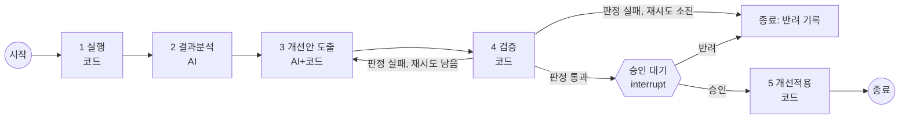
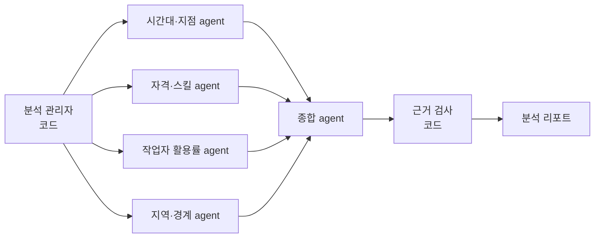

# 보강 기획: LangGraph 오케스트레이션 · 멀티에이전트 분석 · AgentFlow 연동

이 문서는 `docs/plan.md`를 **수정하지 않고** 추가로 적용하는 보강 기획이다.
plan.md의 원칙(AI는 제안, 코드는 검증, 사람은 결정)과 CLAUDE.md의 규칙은 그대로 따른다.
둘이 충돌하면 plan.md와 CLAUDE.md가 우선하며, 충돌을 발견하면 구현 전에 알린다.

적용 시점: plan.md의 **M1(워크플로우 뼈대) 완료 후**.

## 1. 무엇을 보강하나

| 보강 | 위치 | 이유 |
|---|---|---|
| A. LangGraph 오케스트레이션 | 워크플로우 5단계의 상태 관리 | 체크포인트(중간부터 재실행), interrupt(승인 대기), 조건부 엣지(재시도), 그래프 시각화를 기본 기능으로 얻음 |
| B. 멀티에이전트 분석 | 2단계 결과분석 | 단일 분석 agent가 활용률에 드러나는 패턴(P3)을 놓친 문제를 관점별 전문 agent로 보완 |
| C. 제안·검토 agent (선택) | 3단계 개선안 도출 | 코드 검사 전에 개선안의 논리를 한 번 더 점검. 효과는 B보다 작음 |
| D. AgentFlow 연동 (향후) | 레포 외부 | 트리거·승인·감사·비용 관리를 AgentFlow(agent_orch)가 맡는 상위 구조 |

**보강하지 않는 곳**: 1단계 실행, 4단계 검증, 5단계 개선적용은 결정적인 코드 단계로 유지한다. 엔진 자리에는 LLM agent를 넣지 않는다.

## 2. 적용 원칙

- LangGraph는 **오케스트레이션 계층에만** 쓴다. 노드 안에서는 코어 함수(`pack.solve`, `analyze`, `propose`, `params_errors`, `simulate_params` 등)와 코어의 도구 루프(`run_tool_loop`)를 그대로 호출한다.
- LangChain의 agent·도구·LLM 래퍼로 코어를 다시 감싸지 않는다. 하네스와 근거 검사가 코어에 있으므로, 다시 감싸면 같은 일을 두 번 하고 통제 장치가 흐려진다.
- LLM 호출은 코어의 `AnthropicClient` 또는 가짜 LLM(`tests/fake_llm.py`)만 사용한다.
- 각 단계 결과는 지금처럼 실행 ID 아래 JSON 파일로도 저장한다. UI와 재현성은 이 파일을 기준으로 한다 (LangGraph 체크포인트는 실행 제어용).
- LangGraph는 버전별 API 차이가 있으므로 설치 버전을 고정하고, 구현 전에 해당 버전의 공식 문서로 API를 확인한다.

## 3. A. LangGraph 오케스트레이션

### 3.1 상태

| 필드 | 내용 |
|---|---|
| run_id | 워크플로우 실행 ID |
| engine, model_version | 챔피언 엔진과 버전 |
| scenario_set | 학습용·검증용 시나리오 세트 식별자 |
| execution | 1단계 결과 (지표, 결정 레코드 파일 경로) |
| analysis | 2단계 리포트 |
| proposals | 3단계 개선안 (허용 범위 검사 결과 포함) |
| validation | 4단계 챔피언/도전자 비교와 판정 |
| decision | 사람의 승인·반려와 메모 |
| retry_count | 4단계 실패 후 3단계로 되돌린 횟수 |
| errors | 단계별 오류 |

### 3.2 그래프

- 재시도 상한은 `settings/workflow.yaml`에서 읽는다 (기본 1회).
- 승인 대기는 interrupt로 구현하고, CLI의 `approve`·`reject` 명령이 같은 실행을 재개한다.
- 체크포인트 저장소는 `runs/` 아래 SQLite를 쓴다.
- 그래프를 Mermaid로 내보내는 명령을 둔다 (UI·발표용).

### 3.3 완료 기준

- 기존 M1 상태 머신과 **같은 입력에서 같은 단계 결과**가 나오는 동등성 테스트 통과 (가짜 LLM)
- 승인 대기에서 프로세스를 종료했다가 다시 실행해도 같은 지점부터 재개
- 검증 실패 → 재시도 → 소진 경로를 가짜 LLM 시나리오로 테스트

## 4. B. 멀티에이전트 분석

### 4.1 구성

| agent | 보는 관점 | 쓰는 도구 |
|---|---|---|
| 시간대·지점 | 시간대·지점별 실패 집중 | 코어 `Aggregator`의 해당 차원 집계 |
| 자격·스킬 | 기술·자격 부족으로 인한 실패 | 사유 코드별 집계, 작업자 자격 분포 |
| 작업자 활용률 | 가용 인력인데 배정이 적은 패턴 (실패 건수에 드러나지 않는 문제) | 작업자별 활용률 집계 (코어에 없으면 이 레포에 도구 추가) |
| 지역·경계 | 관할 경계 지역의 실패 | 지역 차원 집계 |
| 종합 | 중복 제거, 우선순위, 하나의 리포트로 통합 | 각 agent 결과 |

- 관리자는 LLM이 아니라 코드로, 정해진 네 agent에 같은 실행 결과를 나눠 준다.
- 네 agent는 병렬로 실행하고, 각각 LLM 호출 상한을 둔다.
- 종합 리포트의 모든 수치는 코어의 근거 검사를 통과해야 한다 (인용 결과에 없는 수치는 제외).
- 출력 형식은 단일 분석 agent의 리포트와 같게 맞춘다. 3단계는 어느 쪽에서 리포트가 와도 똑같이 동작해야 한다.

### 4.2 평가

같은 시나리오와 같은 정답표(P1~P4)로 **단일 분석 agent 대 멀티에이전트 분석**을 비교한다.

| 지표 | 내용 |
|---|---|
| 탐지율 | 심어둔 패턴 중 찾은 비율 (특히 P3) |
| 오탐 | 정답표에 없는 발견 중 사람이 오탐으로 판정한 건수 |
| 비용 | LLM 호출 수, 토큰 |
| 시간 | 분석 단계 소요 시간 |

리허설(가짜 LLM)과 실제 API 결과를 구분해 기록한다. 리허설 수치는 "리허설 예시"로 표시한다.

## 5. C. 제안·검토 agent (선택)

- 제안 agent가 개선안을 만들면, 검토 agent가 분석 리포트와 대조해 논리적 결함(근거 없는 변경, 부작용 미고려)을 지적한다.
- 검토 결과는 개선안에 첨부만 하고, 채택 여부는 여전히 코드 검사와 사람 승인이 정한다.
- 4장 B가 끝나고 여유가 있을 때만 진행한다.

## 6. D. AgentFlow 연동 (향후)

AgentFlow(`agent_orch`)는 에이전트 등록·실행·트리거·승인·감사를 맡는 상위 플랫폼으로 둔다. 이 레포는 최적화 도메인의 실제 일을 맡는다.

| 연결 | 방식 |
|---|---|
| 호출 | 이 레포를 MCP 서버로 노출 (`run_workflow`, `get_status`, `get_validation`, `approve`, `reject`). AgentFlow의 MCP 클라이언트가 호출 |
| 정기 실행 | AgentFlow cron 트리거 |
| 승인 | AgentFlow의 승인은 **실행 전 승인**이고, 이 레포의 승인은 **검증 후 반영 승인**이다. 개선적용을 별도 실행으로 분리해 승인 대기를 걸거나, MCP `approve` 호출을 AgentFlow 승인 대기열 뒤에 두는 방식으로 맞춘다 |
| 거버넌스 | 분석·개선안 agent의 실행 기록, 비용, 도구 루프 이상을 AgentFlow의 감사·이상 탐지·ROI로 관리 |
| 시뮬레이션 | AgentFlow의 world_state·시뮬레이션 도구 패턴을 멀티에이전트 시뮬레이션(고객·작업자·상담사) 실험장으로 검토 |

이 레포에서는 MCP 서버까지만 만든다. AgentFlow 쪽 변경은 그 레포에서 따로 진행한다.

## 7. 보강 마일스톤

plan.md의 마일스톤과 구분하기 위해 X로 표기한다.

| 마일스톤 | 내용 | 시점 |
|---|---|---|
| X1 | LangGraph 전환: 상태·그래프·체크포인트·interrupt, 동등성 테스트, Mermaid 내보내기 | M1 직후 |
| X2 | 멀티에이전트 분석: 네 관점 agent + 종합, 단일 대 멀티 비교 평가 | X1 후, M2와 병행 가능 |
| X3 (선택) | 제안·검토 agent | X2 후 여유 시 |
| X4 | MCP 서버 노출, AgentFlow 연동 설계 메모 | M3 이후 |

## 8. 의존성

- `langgraph`와 SQLite 체크포인트 패키지 (버전 고정)
- LangChain의 agent·LLM 패키지는 추가하지 않는다. LangGraph가 요구하는 최소 의존성만 허용한다
- MCP 서버(X4)는 공식 Python MCP SDK 사용
